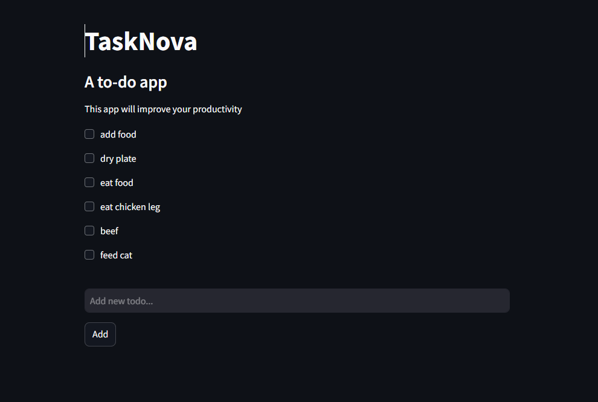

# TaskNova - A Minimalistic To-Do App

Welcome to **TaskNova**, a simple and effective to-do app designed to improve your productivity by helping you track and complete your daily tasks. This lightweight application provides an intuitive interface with essential functionality to get things done.

## Features
- **Add Tasks**: Quickly add new tasks to your to-do list.
- **Manage Tasks**: Mark tasks as completed as you go through your day.
- **Persistent Storage**: All tasks are saved in a text file in the backend, ensuring your data is always available.
- **Streamlit Deployment**: TaskNova is built using Python and deployed via Streamlit, offering a clean and responsive web experience.

## How It Works
1. **Backend**: Tasks are stored in a simple text file.
2. **Frontend**: The app is hosted using Streamlit to provide an easy-to-use interface.
3. **Real-Time Updates**: Add, view, and manage your tasks instantly without refreshing the page.

## Screenshot


## Try It Out
You can check out TaskNova live by visiting this link:
[TaskNova App](https://tasknova.streamlit.app/)

## Installation and Usage (Local Deployment)
To run TaskNova on your local machine, follow these steps:

1. **Clone the Repository**
   ```bash
   git clone https://github.com/salikhassan/task-nova.git
   cd task-nova
   ```

2. **Install Dependencies**
   Ensure you have Python installed. Then, install the required packages:
   ```bash
   pip install -r requirements.txt
   ```

3. **Run the App**
   Start the Streamlit server:
   ```bash
   streamlit run web.py
   ```

4. **Access the App**
   Open the provided URL in your browser (typically `http://localhost:8501`).

## Technologies Used
- **Programming Language**: Python
- **Framework**: Streamlit
- **Data Storage**: Text file

---

Start managing your tasks effortlessly with TaskNova! Let us know if you have any feedback or suggestions by creating an issue in the repository.
